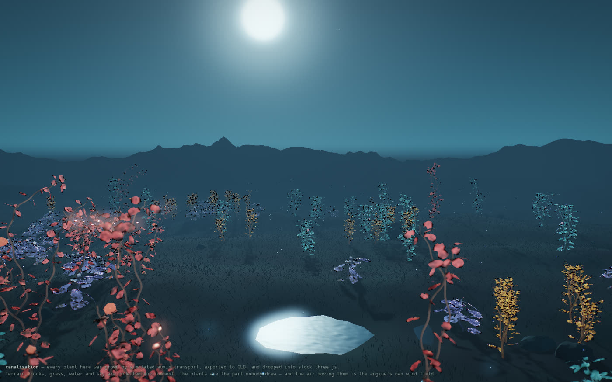

# Canalisation

A plant grown from its own chemistry — a real-time browser simulation of **auxin**,
the hormone that tells plant cells where to become things. Leaf arrangement, vein
networks, leaf silhouettes, petal number, fruit lobing, ripening — and when a
specimen is finished — all fall out of the transport equations.

**Nothing about the plant's shape is drawn.** No shape code, no outlines, no curves,
no counts. That is the whole claim, and it is the one thing this project will not
trade away.

```bash
git clone https://github.com/aj-dev-smith/canalisation
cd canalisation
node build.js && open canalisation.html
```

No server, no dependencies, no build toolchain. Node 18+ to run `build.js`, a
browser with WebGL2 to watch it. `canalisation.html` is a single self-contained
file — you can open the committed one directly without building.

## What emerges

Every one of these is a consequence of the chemistry, not a parameter:

- **Phyllotaxis** — where each leaf goes around the stem, and the angle between them
- **Vein networks** — midrib, secondaries and reticulation, by auxin canalisation
- **Leaf outlines** — including teeth and lobes, grown from margin convergence points
- **Petal number** — nobody tells it five
- **Fruit lobing** and the ripening wave across the surface
- **The end of a life** — a specimen runs out of growing points, drains each blade
  into its own veins and drops them, leaving a standing seed head. Nothing
  schedules that; it falls out of how much leaf the plant managed to build

The complete list of spatial priors that *are* imposed lives in
[docs/SCIENCE.md](docs/SCIENCE.md) under "What is imposed". It is short on purpose.
Adding to it is a real cost.

## What the plant is subject to

A second, smaller category, and it is worth keeping separate: the plant does not
only grow, it stands in an **environment**. That is physics the plant is subject to
rather than chemistry the plant does, and none of it describes a shape.

- **One wind field** — a log-law boundary layer with a Kolmogorov gust spectrum,
  advected by Taylor's frozen-turbulence hypothesis and exactly divergence-free.
  The simulation and the shader read it from one baked table of modes, so it cannot
  quietly become two functions that resemble each other
- **The stems bend** — each axis is a damped cantilever off `EI` on the radii
  Murray's law already grew, loaded by its own canopy. How far each species sways
  spans eightyfold with no per-species number anywhere
- **Shed blades fall by aerodynamics** — an integrated quasi-steady plate. Which of
  flutter, tumble, chaos or glide a leaf picks is selected by the width its own
  margin grew, so blades on one specimen do not fall alike

One number in all of that is a choice — how hard it is blowing — and it is a slider
in the page. Everything downstream of it is derived from it, so it cannot make the
physics wrong, only the weather.

## A garden

The scene holds a **stand of plants**, not one specimen: several species, each with
its own seed, position and head start, so a seedling can stand beside a flowering
adult beside a standing seed head. From the browser console:

```js
__app.plantGarden(7, { radius: 20 })    // a clearing
__app.holdSenescence()                  // pause the last act while you look at it
```

They are all in the **same** wind field, at real positions — so a gust *crosses* the
stand rather than arriving everywhere at once. That falls out of the field already
being right and costs nothing.

Where a plant is standing is scene composition rather than chemistry, and it is
listed here rather than under "what emerges" for that reason. It says where a seed
landed, not what grows out of it.

## The field, in three.js



The grown plants also leave the building: an exporter takes any specimen out as a
standard **GLB** (real metres, vein networks as geometry, the species palette in
the file), and [`demo/`](demo/) is a wild field of 132 of them standing in an
ordinary procedural three.js night — terrain, grass, rocks, a pond, a moon, all
modelled and labelled as such. The plants are the part nobody drew, the air moving
them is the engine's own wind field imported straight from `src/37_wind.js`, and a
camera that behaves like a foraging bee films it. See
[demo/README.md](demo/README.md) for how it is built, verified and deployed.

```bash
node demo/build_assets.mjs   # grow the stand (deterministic, ~10 min cold)
node demo/serve.mjs          # http://localhost:8460
```

## Four ways of looking at it

The renderer is decoupled from the simulation, and a **view** decides which channels
of it reach the screen. All four are the same plant, the same solver and the same
frame; what changes is how much of what the simulation knows is allowed through.

| | |
|---|---|
| **natural** | The plant standing in light. Opaque tissue, the canalised veins glowing inside it. |
| **cells** | No lamina at all — every leaf, growing point and ovary wall drawn at the resolution the solver runs at. Each disc is one cell holding the auxin it actually holds; each needle is the wall it has loaded its pumps onto. About 67,000 of them on a Cathedral Fern. |
| **flux** | The organism as one transport network. Drop the cells and keep what they are doing: veins and pump directions, nothing else. Tip, leaf and fruit end up in the same visual language, because they are the same solver on different geometry. |
| **field** | An instrument rather than a picture. Auxin concentration on one ramp, the species colours discarded, no bloom or grade. Two species look alike in here — which is the point, since a species is only a parameter set. |

The switch is in the bar along the bottom, or from the console:

```js
__app.setRenderView('cells')
```

**None of this adds anything to what is imposed.** Every channel was already being
computed; a view turns it up or down, and the `cells` and `flux` views draw nothing
that was not read straight off a cell field. The one thing a view decides that the
simulation does not is *when a needle is too small to be worth drawing* — a statement
about screen pixels rather than about a plant.

## Known limitations

Read this before opening an issue about it:

**Phyllotaxis is ordered but does not lock to the golden angle.** Divergence wanders
90–160° with a standard deviation of 80–100°, rather than settling at 137.5°. Two
hypotheses for why were tested with controlled sweeps and both were falsified —
the write-ups are in [docs/JOURNAL.md](docs/JOURNAL.md).

This is a real, diagnosed limitation, not a bug awaiting a patch. **Pull requests
that force 137.5° with a fudge factor will be declined**, however well they make it
look. Displaying the honestly measured number, spread and all, is the point of the
piece. A structural mechanism that tightens the angle on its own is very welcome —
see idea #3 in [docs/ROADMAP.md](docs/ROADMAP.md).

**An attached leaf does not rock on its own stalk, and that is now a decision.** The
stem sways for real and a leaf hangs by a force balance, but the blade's own twist about
its midrib ships **switched off**. It was built, and then the petiole stopped being
guesswork — it used to be drawn at half the *stem's* radius, and stiffness goes as the
fourth power of it — and at a physical stiffness the model does not become visible, it
becomes wrong: a plate hinged along its own midrib is statically unstable in twist, so
blades snap between face-on attitudes at 10–25 Hz when the wind's own fastest gust is
1.78 Hz. Three causes were measured and ruled out first; the write-up is in
[docs/JOURNAL.md](docs/JOURNAL.md).

It is disabled and re-measurable rather than deleted. **Pull requests that switch it back
on by widening the petiole's `kappa` will be declined** — that constant has two
independent measurements behind it, and the twist swings from invisible to pinned across
its published error bar, so tuning it until the motion looks right is tuning rather than
measuring. What would have to change is the model, and idea #9 in
[docs/ROADMAP.md](docs/ROADMAP.md) says what.

**Senescence is half emergent.** *When* a specimen dies is a physical condition with
nothing scheduling it. *The order* it dies in is imposed — oldest first, up the
plant. Four attempts to derive that order from auxin transport were falsified and
are written up in [docs/JOURNAL.md](docs/JOURNAL.md).

## How it works

`stepAuxin()` in [src/10_auxin.js](src/10_auxin.js) is the entire thesis. It runs on
**any** topology — a growing 2D cell sheet, a 1D chain, an icosphere. The meristem,
the leaf margin, leaf venation and the fruit are all that same solver on different
geometry with different boundary conditions.

```
src/00_math.js      vec3/mat4, seeded PRNG, smoothstep
src/10_auxin.js     THE ENGINE. CellField + stepAuxin(). Everything else is geometry
src/20_meristem.js  growing tip: dividing cell sheet, organ initiation, divergence
src/25_margin.js    leaf outline grown from margin convergence points
src/30_leaf.js      blade: interior lattice, vein canalisation, bake
src/35_fruit.js     ovary wall as icosphere shell; ovules, swelling, ripening
src/37_wind.js      THE AIR. One field, evaluated by the simulation and the shader
src/38_shoot.js     falsified experiment, ships disabled. Whole-plant auxin transport
src/39_fall.js      a blade in air, attached or shed. Quasi-steady plate aerodynamics
src/39a_stem.js     the stem bends: axes as coupled damped cantilevers off EI
src/40_plant.js     the organism: axes, branching, florigen, fruit set, senescence
src/50_geom.js      simulation state -> triangles, ribbons, points. Level of detail
                    for veins and for cells lives here
src/60_render.js    WebGL2: forward pass, bloom, depth of field, grade
src/70_app.js       species presets, camera director, scene assembly, and VIEWS --
                    which channels of the simulation reach the screen
src/80_main.js      UI wiring
```

Sources are numbered so that concatenation order is dependency order.
`canalisation.html` is a **build artifact** — never edit it by hand.

`39a_stem.js` is lettered rather than numbered because it has to load after the air
and before the organism. There is no vertex-shader sway: the geometry moves for real.

## Testing

The simulation is tested headlessly in Node, no browser required. These harnesses
print numbers and ASCII renderings in seconds, where a visual check takes minutes
and cannot tell a rendering bug from a simulation bug.

```bash
node test/smoke.mjs                                # invariants; a CI gate
node test/views.mjs                                # render views: cost, and is the cell table honest; a CI gate
node test/pattern.mjs '{"T":40,"D":6}' '{"G":0}'   # is the tissue patterning at all?
node test/phyllo.mjs                               # divergence angle statistics
node test/margin.mjs                               # grow a leaf outline, ASCII silhouette
node test/fruit.mjs                                # grow fruits, ASCII radius map
node test/flower2.mjs                              # full life cycle incl. axillary flowers
node test/senesce.mjs                              # a dying blade, drawn: ASCII map of what still holds colour
node test/wind.mjs                                 # the wind field: profile, gusts, spectrum, GLSL round trip
node test/stem.mjs                                 # the stem as a beam: ringdown vs the analytic pre-flight
```

**Six of them assert and exit non-zero: `smoke.mjs`, `views.mjs`, `wind.mjs`,
`stem.mjs`, `petiole.mjs` and `veinlod.mjs`;** of those, `smoke` and `views` are the
two wired into CI. The rest are diagnostic instruments — you read their output, they
do not pass or fail. The split is deliberate: a *physical* claim can be checked
against a number worked out beforehand, so it gets a real assertion, while an
*emergent* quantity cannot be pinned down in a test without quietly turning it into
an imposed one.

`CLAUDE.md` lists all twenty-one harnesses, plus the archived experiments kept runnable
so their falsified results stay reproducible. Some checks cannot be done in Node at
all — whether the emitted shader agrees with the simulation on a real GPU, what
frequencies the drawn scene is actually moving at, and whether a render view looks
like anything — and live in `tools/`.

## Documentation

| Doc | What's in it |
|---|---|
| [docs/SCIENCE.md](docs/SCIENCE.md) | The biology, the papers, what emerges vs what is imposed |
| [docs/TUNING.md](docs/TUNING.md) | Hard-won parameter regimes. **Read before touching any constant** |
| [docs/PITFALLS.md](docs/PITFALLS.md) | Bugs that cost hours, several of which will bite you again |
| [docs/JOURNAL.md](docs/JOURNAL.md) | Negative results, design forks and why they went the way they did |
| [docs/ROADMAP.md](docs/ROADMAP.md) | What is unfinished, ranked |

[CLAUDE.md](CLAUDE.md) is the orientation file for AI coding agents working in this
repo. It is a condensed version of the above and is kept in sync with it.

## Contributing

Issues and pull requests are welcome — see [CONTRIBUTING.md](CONTRIBUTING.md).
[docs/ROADMAP.md](docs/ROADMAP.md) is the ranked list of what is actually worth
doing next, if you want somewhere to start.

## License

[MIT](LICENSE). Take it and do whatever you like with it.

## Colophon

Built by AJ Smith with Claude Opus 5. The `docs/` directory is a genuine research
record, including the experiments that did not work.
